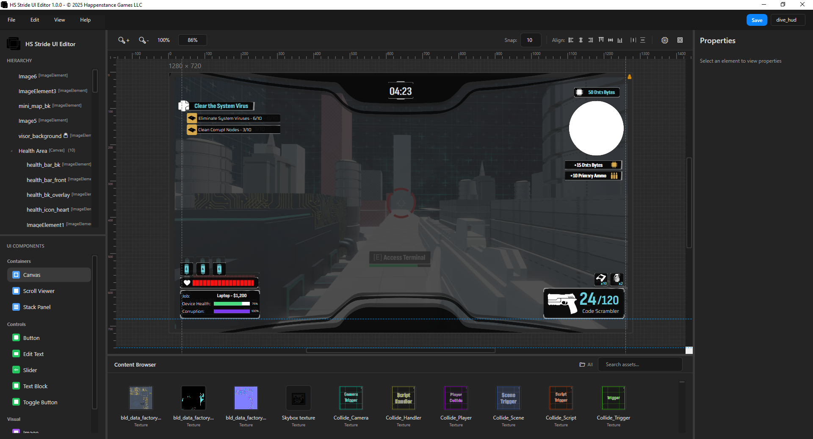

# HS Stride UI Editor

A standalone visual editor for Stride UI. An alternative to GameStudio's built-in UI editor with a modern workflow. Think Substance Painter for UI - work visually, bake down to Stride's format.





**This is NOT a separate UI framework.** This is core Stride UI, just made easier to work with. No runtime dependencies, no extra libraries in your game.

### Why This Editor?

Some workflows are easier with a dedicated tool:

- **Canvas-based positioning** - X/Y coordinates instead of margin values
- **Visual drag and resize** - Handles and direct manipulation
- **Arrow key nudging** - Precise 1px or 10px movement
- **Element locking** - Work with overlays without selecting them
- **Reference backgrounds** - Trace over design mockups
- **True color preview** - No overlay affecting your colors

## 🔄 How This Works

**Work in the editor** → **Save as .sduipage** → **Use in Stride**

The editor simplifies the workflow but outputs standard Stride UI files. Your game code works exactly the same - just the authoring is easier.

> ⚠️ **Important:** This editor directly modifies `.sduipage` files using the toolkit. **Back up your UI pages before editing.** Stride does not hot-reload UI assets - you must **close and reopen GameStudio** to see changes made in this editor.

## 🚀 Quick Start

### Requirements

- Windows (WPF application)
- .NET 8.0
- A Stride project to connect to

### Running

Download the latest version from [Releases](../../releases) or build it yourself:

```bash
dotnet build HS.Stride.UI.Editor.sln
dotnet run --project HS.Stride.UI.Editor.csproj
```

### Basic Workflow

1. **File → Connect to Project** - Select your Stride .sln
2. **File → New** or **File → Open** - Create or edit a .sduipage
3. **Drag elements** from UI Components panel to canvas
4. **Drag assets** from Project Content to create images
5. **Edit properties** in the right panel
6. **File → Save** - Outputs standard Stride format

### Importing Textures

For best results, use **File → Import Textures** in the editor to add new images to your project.

If you import textures directly in Stride GameStudio:
1. Make sure Stride has **saved the asset** (no asterisk in title bar)
2. Close and reopen this editor to see new assets, OR use the **Refresh button** (🔄) in the Content Browser

> The refresh button should work in most cases, but closing/reopening is the guaranteed approach if you encounter issues.

## 🎨 Features

### Canvas Workflow

- **Absolute positioning** with X/Y coordinates
- **Visual drag and resize** with handles
- **Shift+resize** for proportional scaling
- **Arrow keys** to nudge (Shift for 10px)
- **Guides and snapping** for alignment

### Editor-Only Tools

- **Reference backgrounds** - Add mockup images to trace over
- **Element locking** - Lock elements so you don't accidentally move them
- **Canvas overflow** - Allow elements outside the artboard for overlays
- **Folder filters** - Filter Project Content by folder (state saved per-project)

### Full Undo/Redo

- Every action is undoable (Ctrl+Z / Ctrl+Y)
- Move, resize, create, delete, reparent - all tracked

### Hierarchy Management

- **Visual tree view** with drag-drop reordering
- **Drop indicators** showing exactly where elements will land
- **Parent/child relationships** preserved correctly

## ⚙️ What's Hidden (and Why)

This editor uses a canvas-based workflow - think of canvas elements like divs/containers for different areas of your UI, positioned absolutely. Some Stride properties don't fit this approach and are hidden to keep things simple:

| Hidden                                      | Why                                                                            |
| ------------------------------------------- | ------------------------------------------------------------------------------ |
| **HorizontalAlignment / VerticalAlignment** | These position relative to parent bounds, not content alignment. Confusing UX. |
| **Grid / UniformGrid properties**           | Janky behavior in Stride. We force Canvas workflow.                            |
| **StretchType / StretchDirection**          | Use Shift+drag instead for proportional control.                               |
| **Grid Cell properties**                    | Only relevant for Grid containers (which we hide).                             |

**All hidden properties still load/save correctly.** If you open a page made in GameStudio that uses these, they're preserved.

## 📦 Dependencies

- **[HS-Stride-Editor-Toolkit](https://github.com/Keepsie/HS-Stride-Editor-Toolkit)** - Core library for reading/writing Stride assets
- **[HS-Stride-Mass-Importer](https://github.com/Keepsie/HS-Stride-Mass-Importer)** - Batch import images and font into your project (File → Import Images)

## ⌨️ Keyboard Shortcuts

| Shortcut              | Action                           |
| --------------------- | -------------------------------- |
| Ctrl+S                | Save                             |
| Ctrl+Shift+S          | Save As                          |
| Ctrl+Z                | Undo                             |
| Ctrl+Y                | Redo                             |
| Ctrl+D                | Duplicate selection              |
| Ctrl+C/X/V            | Copy/Cut/Paste                   |
| Delete                | Delete selection                 |
| Arrow keys            | Move 1px                         |
| Shift+Arrows          | Move 10px                        |
| Ctrl+Click            | Multi-select                     |
| Middle Mouse          | Pan canvas                       |
| Space+Drag            | Pan canvas (Photoshop style)     |
| Ctrl/Alt+Scroll       | Zoom in/out                      |
| Shift+Scroll          | Horizontal scroll                |
| Shift+Drag (resize)   | Maintain aspect ratio            |
| Alt+Drag (resize)     | Scale from center                |

## 🛠️ Development

This tool was built for our own Stride UI workflow. Updates happen when needed.

- **Report bugs:** Open an issue on GitHub
- **Request features:** Describe your use case
- **Contribute:** PRs welcome

## 📄 License

MIT License - see LICENSE.txt for full text.

---

Copyright © 2025 Happenstance Games LLC
